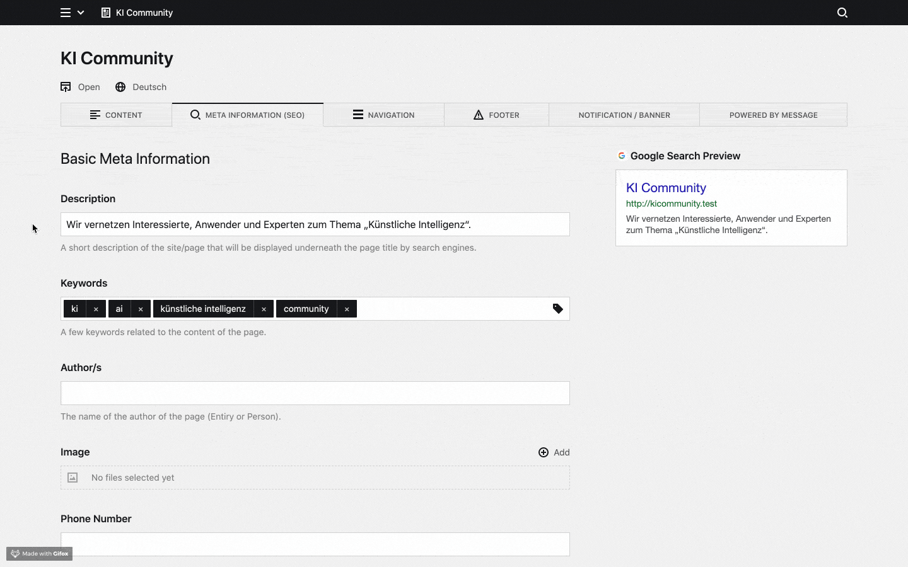

# Meta Knight – SEO for Kirby

Meta Knight is a SEO and Social Media Sharing Plugin for [Kirby](https://getkirby.com). Meta Knight makes it easier to work with meta information in Kirby's panel.

Meta Knight provides blueprints, snippets and custom preview sections. At the moment the plugin covers:

- Basic Meta Information (Title, Description, Keywords, Canonical URL, etc.) + Google Search Preview
- Open Graph + Facebook Sharing Preview
- Twitter Cards + Twitter Cards Preview
- Robots Settings

All of the above is neatly organized in a pre-composed SEO tab that can easily be added to any blueprint.



This plugin was originally developed at [diesdas.digital](https://www.diesdas.digital) by Jonathan Muth, Lorenz Seeger and Leslie Büttel. Meta Knight exists because we wanted to standardize the way we handle meta information across all our projects.

We'd also like to thank @distantnative for his help along the way! Without him this plugin wouldn't be what it is today.

## Config options

### Site title

#### Order

By default the _Page Title_ will be rendered before the _Site Title_. Resulting in a title tag that looks like this: `<title>Page Title – Site Title</title>`. If you want the _Site Title_ to come first, simply add the following lines to your Kirby `config.php` file:

```
'diesdasdigital.meta-knight' => [
    'siteTitleAfterPageTitle' => false,
],
```

You'll then get a title tag that looks like this: `<title>Site Title – Page Title</title>`.

#### Customize home page title

By default the title tag of the home page will include both the _page title_ and the _site title_ and look like this: `<title>Page Title – Site Title</title>`. If you want to only display the site title on the homepage, simply add the following lines to your Kirby `config.php` file:

```
'diesdasdigital.meta-knight' => [
    'siteTitleAsHomePageTitle' => true,
],
```

The title tage of your home page will then look like this: `<title>Site Title</title>`

The same can be done with the page title on the homepage

```
'diesdasdigital.meta-knight' => [
    'pageTitleAsHomePageTitle' => true,
],
```

will result in `<title>Page Title</title>`

Keep in mind: Both options cannot be enabled at the same time.

### Customizeable `page title | site title` separator

The separator between page title and site title can be customized like this:

```
'diesdasdigital.meta-knight' => [
    'separator' => ' \o/ ',
],
```

The default value is ` | `.

### Canonical URLs

Meta Knight gives you control over how the auto-generated canonical URLs for your pages are rendered. By default canonical URLs do not include the `www.` subdomain. If you wish the canonical URLs to include `www.` please set the following option in config.php:

```
'diesdasdigital.meta-knight' => [
    'canonicalURLIncludesWWW' => true,
],
```

Please note:

- Auto-generated canonical URLs will always be the `https://` version of any given page.
- Do not enable `canonicalURLIncludesWWW` if your Kirby site is running on another subdomain.
- A canonical URL that was manually entered in the SEO Tab will always override the auto-generated canonical URL of any given page.


---

## Installation

### Download

Download and copy this repository to `/site/plugins/kirby-meta-knight`.

### Git submodule

```bash
git submodule add https://github.com/diesdasdigital/kirby-meta-knight.git site/plugins/kirby-meta-knight
```

### Composer

```bash
composer require diesdasdigital/kirby-meta-knight
```

## Setup

How to add Meta Knight to Kirby:

1. Add this tab to your site's blueprint (site.yml): `seotab: seo` (Meta Knight uses the site's meta information as a fall back when no meta information is provided for a page)

2. Add this tab to all your page blueprints: `seotab: seo`

3. Add these two snippets to your head: `<?php snippet('meta_information'); ?>` + `<?php snippet('robots'); ?>`

Example:

```yaml
title: Site

tabs:
  content:
    icon: text
    label: Content
    sections:
      drafts:
        headline: Drafts
        type: pages
        status: draft
        templates:
          - default
          - masthead
        image:
          query: false
      unlisted:
        headline: Unlisted
        type: pages
        status: unlisted
        image:
          query: false
      listed:
        headline: Listed
        type: pages
        status: listed
        image:
          query: false

  seotab: seo
```

## Options

Currently the plugin isn't configurable via the `config.php` file. This is something we are thinking about adding in a future release.

## Development

### Development

You can start the dev process with …

```bash
yarn dev
```

This will automatically update the `index.js` and `index.css` of Meta Knight as soon as you make changes.
It will also enable hot module reloading in the panel. Reload the panel once and afterwards you should
see changes immediately without further reloading.

### Production

As soon as you are happy with the changed you've made to Meta Knight, you should build the final version with

```bash
yarn build
```

This will automatically create a minified and optimized version of your `index.js` and `index.css` that will improve load time in production environments.

## License

MIT – See LICENSE.md for more info.

## Credits

- [diesdas ⚡️ digital](https://github.com/diesdasdigital)
